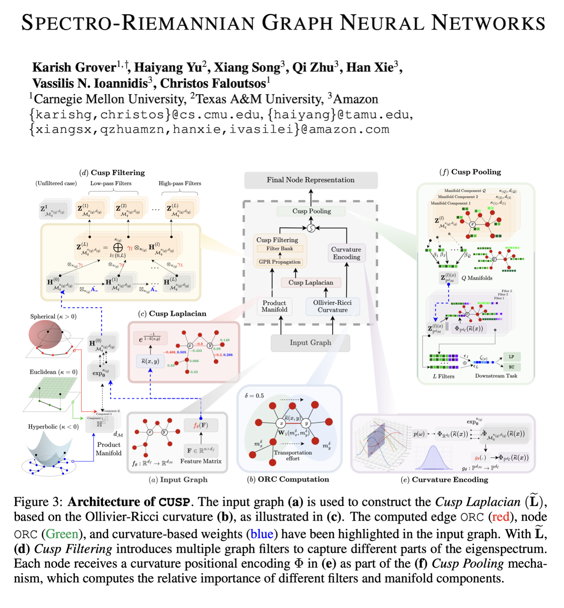

## Spectro-Riemannian Graph Neural Networks
Official implementation of [Spectro-Riemannian Graph Neural Networks](https://www.arxiv.org/abs/2502.00401) (ICLR 2025).

<p align="center">
  
</p>

## 🛠 Dependencies and Installation

- [geoopt](https://github.com/geoopt/geoopt) `0.5.0` (For Riemannian optimization and implementation of $\kappa$-stereographic model)
- [GraphRicciCurvature](https://github.com/saibalmars/GraphRicciCurvature) `0.5.3.2` (For computing Ollivier-Ricci Curvature)
- torch `2.4.0` (Implementation in PyTorch)
- torch_geometric `2.6.1`
- Other required packages in `requirements.txt`

```python
# git clone this repository
git clone https://github.com/amazon-science/cusp.git

# install python dependencies
pip3 install -r requirements.txt
```
## 💽 Datasets
We have performed extensive experimentation and ablation studies across 8 datasets $-$ Homophilic (`Cora`, `Citeseer`, `PubMed`) and Heterophilic (`Chameleon`, `Actor`, `Squirrel`, `Texas`, `Cornell`). The datasets are downloaded automatically from `torch_geometric` and saved in `data/` directory. Consider the following script from `train.py`. 

```python
datasets = {
"Cora": Planetoid(root="data/Cora", name="Cora", transform=T.ToUndirected()),
"Citeseer": Planetoid(root="data/Citeseer", name="Citeseer", transform=T.ToUndirected()),
"PubMed": Planetoid(root="data/PubMed", name="PubMed", transform=T.ToUndirected()),
"Chameleon": WikipediaNetwork(root="data/WikipediaNetwork", name="chameleon", transform=T.ToUndirected()),
"Actor": Actor(root="data/Actor", transform=T.ToUndirected()),
"Squirrel": WikipediaNetwork(root="data/WikipediaNetwork", name="squirrel", transform=T.ToUndirected()),
"Texas": WebKB(root="data/WebKB", name="Texas", transform=T.ToUndirected()),
"Cornell": WebKB(root="data/WebKB", name="Cornell", transform=T.ToUndirected())}
```

Specify the dataset to be used using the `--dataset` argument while running `train.py`.


## 🔂 Training

### Key Training Arguments

The following table describes some important optional arguments that control different ablations of the **CUSP** model. The entire list of training arguments are present in `train.py`.

| Argument                  | Description |
|---------------------------|-------------|
| `use_curvature_encoding` | Enables **functional curvature encoding** for improved representation learning. |
| `use_cusp_pooling`       | Uses curvature-based positional encoding in **Cusp Pooling**, allowing hierarchical attention over embeddings. |
| `use_euclidean_variant`  | Forces the **Euclidean variant** of the model, where all manifolds are Euclidean. |
| `use_cusp_laplacian`     | Uses the **Cusp Laplacian** (default). If not set, the model falls back to using the standard graph Laplacian. |
|`K`| Number of filters in the filterbank.|
|`manifold_config`| Product manifold signature to use, for learning representations.|
|`d_f`|Dimension of the functional curvature encoding.|

### Example Usage
To run the full `CUSP` model for the task of node classification using Riemannian Adam optimizer (`radam`), with `K=10` filters, on the `Cora` dataset, for the product manifold signature $\mathbb{H}^{16} \times \mathbb{H}^{16}\times \mathbb{S}^{16} \times\mathbb{E}^{16}$,  use the below script:
```python
python train.py --dataset Cora \
                --epochs 100 \
                --model cusp \
                --optimizer radam \
                --lr 0.01 \
                --num_runs 1 \
                --use_curvature_encoding \
                --use_cusp_laplacian \
                --use_cusp_pooling \
                --K 10 \
                --d_f 64 \
                --ricci_alpha 0.5 \
                --manifold_config H16H16S16E16 \
                --task node_classification
```

To train the **CUSP model** with different ablations use the following commands:

- Euclidean variant without Cusp pooling and curvature encoding for node classification.
```python 
python train.py --dataset Cora --model cusp --epochs 30 --lr 4e-3 --num_runs 2 --euclidean_variant --use_cusp_laplacian --manifold_config H16H16S16E16 --K 10
```

- Full `CUSP` without Cusp Laplacian for link prediction.
```python 
python train.py --dataset Cora --epochs 30 --model cusp --optimizer radam --lr 4e-3 --num_runs 2 --use_curvature_encoding --use_cusp_pooling --K 10 --task node_classification --manifold_config H16H16S16E16
```
## 📞 Contact
If you have any questions or issues, please feel free to reach out to [Karish Grover](https://karish-grover.github.io/) at <a href="mailto:karishg@cs.cmu.edu">karishg@cs.cmu.edu</a>.

## Security

See [CONTRIBUTING](CONTRIBUTING.md#security-issue-notifications) for more information.

## License

This library is licensed under the CC-BY-NC-4.0 License.

## ✏️ Citation

If you think that this work is helpful, please leave a star ⭐️ and cite our paper:

```
@misc{grover2025spectroriemanniangraphneuralnetworks,
      title={Spectro-Riemannian Graph Neural Networks}, 
      author={Karish Grover and Haiyang Yu and Xiang Song and Qi Zhu and Han Xie and Vassilis N. Ioannidis and Christos Faloutsos},
      year={2025},
      eprint={2502.00401},
      archivePrefix={arXiv},
      primaryClass={cs.LG},
      url={https://arxiv.org/abs/2502.00401}, 
}
```